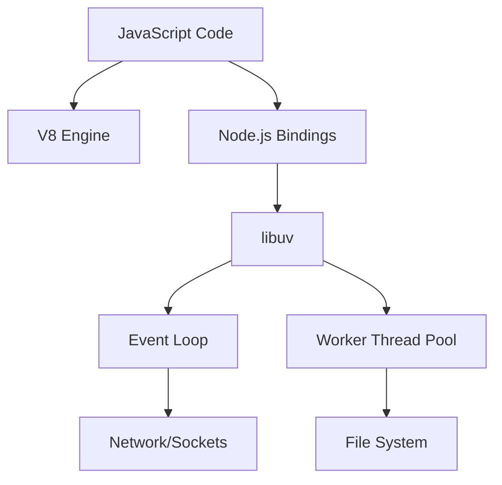
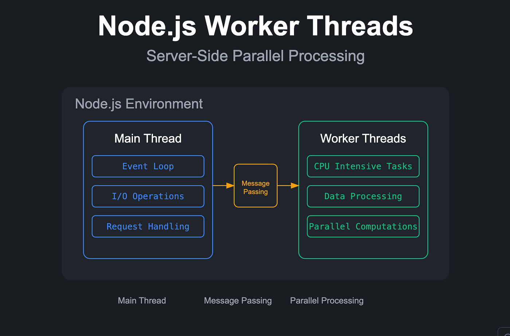

Node.js has revolutionized backend development by introducing an event-driven, non-blocking I/O model to JavaScript. While many developers use Node.js daily to build web servers and microservices, fully understanding *how* it manages to be so fast and scalable requires peeling back the layers of its architecture.

In this deep dive, we'll explore the triumvirate that powers Node.js: **The V8 Engine**, **libuv**, and the **Event Loop**.

---

## 1. The Core Philosophy

At its heart, Node.js is designed to handle thousands of concurrent connections with minimal overhead. Traditional web servers (like Apache) spawn a new thread for every request. While this is conceptually simple, it scales poorly. Threads consume memory and context switching is expensive.

Node.js takes a different approach: **Single-threaded, event-driven, non-blocking I/O.**

> "Node.js is not a framework. It’s not a library. It’s a runtime environment that executes JavaScript outside of a browser."


---

## 2. The V8 JavaScript Engine

V8 is Google's open-source high-performance JavaScript and WebAssembly engine, written in C++. It's the same engine that powers Google Chrome. In the context of Node.js, V8's responsibility is simple: **Compile and execute JavaScript code.**

### How V8 Works

V8 doesn't interpret JavaScript; it compiles it directly to machine code using a Just-In-Time (JIT) compiler. 

1. **Ignition (Interpreter):** Parses JS and generates bytecode.
2. **TurboFan (Optimizing Compiler):** Takes hot functions (frequently executed code) and compiles them into highly optimized machine code dynamically.

Here is an example of a simple function that V8 will highly optimize if called repeatedly:

```javascript
// A simple monomorphic function
function add(a, b) {
  return a + b;
}

// V8 notices `add` is ALWAYS called with integers
for (let i = 0; i < 10000; i++) {
  add(i, i + 1); 
}
```

If you suddenly pass strings to `add("hello", "world")`, V8 will "deoptimize" the function, falling back to bytecode, which is slower. This is why consistent types in JavaScript are crucial for performance!

---

## 3. The Power of `libuv`

While V8 handles the JavaScript execution context, it has absolutely no idea how to talk to the network, read files, or handle operating system events. That's where **libuv** comes in.

libuv is a multi-platform support library written in C. It was originally written specifically for Node.js but is now used by other projects like Julia and Luvit.

### What does libuv do?

libuv provides two critical pieces of infrastructure:
1. **The Event Loop:** The orchestration mechanism.
2. **The Thread Pool:** A pool of worker threads used to handle heavy or blocking operations (like File I/O or Cryptography) that the OS cannot handle asynchronously.

Here's an architectural conceptualization:



---

## 4. The Event Loop Explained

The Event Loop is the beating heart of Node.js. Because Node.js is single-threaded, if a synchronous operation takes 5 seconds, the entire server freezes for 5 seconds. The Event Loop prevents this by offloading I/O operations to the system kernel whenever possible.

When you start a Node.js program, it initializes the Event Loop, processes the provided script, and then begins processing the loop.

### The Six Phases of the Event Loop

The Event Loop operates in specific phases. Each phase has a FIFO queue of callbacks to execute. 

| Phase | Description |
| :--- | :--- |
| **Timers** | Executes callbacks scheduled by `setTimeout()` and `setInterval()`. |
| **Pending Callbacks** | Executes I/O callbacks deferred to the next loop iteration. |
| **Idle, Prepare** | Used internally only by Node.js. |
| **Poll** | Retrieves new I/O events; executes I/O related callbacks (nearly all with the exception of close callbacks, the ones scheduled by timers, and `setImmediate()`). |
| **Check** | `setImmediate()` callbacks are invoked here. |
| **Close Callbacks** | E.g., `socket.on('close', ...)`. |

### Microtask Queue: The VIP Line

Before looking at a code example, we must understand the **Microtask Queue**. Promises (`.then()`, `.catch()`) and `process.nextTick()` don't belong to the libuv Event Loop phases. They belong to V8's Microtask Queue.

**Rule of Thumb:** The Microtask Queue is evaluated *immediately* after the current operation completes, before the Event Loop moves to the next phase. `process.nextTick()` has even higher priority than Promises!

Let's test your understanding:

```javascript
const fs = require('fs');
console.log('1. Script start');
setTimeout(() => console.log('2. setTimeout'), 0);
setImmediate(() => console.log('3. setImmediate'));
process.nextTick(() => console.log('4. nextTick'));
fs.readFile(__filename, () => {
  console.log('5. File Read (I/O)');
});
Promise.resolve().then(() => console.log('6. Promise'));
console.log('7. Script end');
```

**Output Order:**
1. `1. Script start` (Synchronous)
2. `7. Script end` (Synchronous)
3. `4. nextTick` (Microtask - highest priority)
4. `6. Promise` (Microtask)
5. `2. setTimeout` (Timers Phase)
6. `3. setImmediate` (Check Phase)
7. `5. File Read (I/O)` (Poll Phase, completes in a later iteration)

*(Note: Depending on system performance, `setTimeout(0)` and `setImmediate()` can sometimes swap order if called from the main module, but they behave predictably inside an I/O callback).*

---

## 5. Handling Heavy Computations

Because the Event Loop runs on a single thread, **CPU-bound tasks will block it**. If you run a massive `for` loop, or calculate a cryptographic hash synchronously, Node.js cannot serve other requests.



If you must do heavy lifting, you have a few options:

1. **Worker Threads (`worker_threads`):** Introduced in Node v10, this allows you to spawn real OS threads that share memory but execute their own V8 isolates.
2. **Child Processes:** Spawn a completely separate Node.js process using `child_process.fork()`.
3. **Rust/C++ Addons:** Write the heavy logic in a systems language and compile it to a native Node-API (.node) module.

Here is a quick example of offloading work using `worker_threads`:

```javascript
const { Worker, isMainThread, parentPort } = require('worker_threads');

if (isMainThread) {
  // Main Thread: Spawn a worker
  const worker = new Worker(__filename);
  worker.on('message', (msg) => console.log('Worker said:', msg));
  console.log('Main thread continues executing...');
} else {
  // Worker Thread: Do heavy lifting
  let count = 0;
  for (let i = 0; i < 1e9; i++) count++;
  parentPort.postMessage(`Done counting to ${count}!`);
}
```

---

## Conclusion

Understanding the Node.js architecture—how V8 compiles your code, how libuv manages asynchronous operations across OS boundaries, and how the Event Loop phases orchestrate callbacks—is what separates a junior Node.js developer from a senior one.

By respecting the golden rule of Node.js: **"Don't block the Event Loop"**, you can build incredibly performant, scalable systems that can handle hundreds of thousands of concurrent users with ease.

Happy coding!
